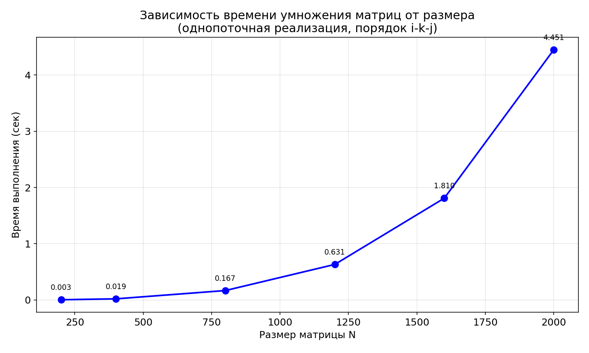
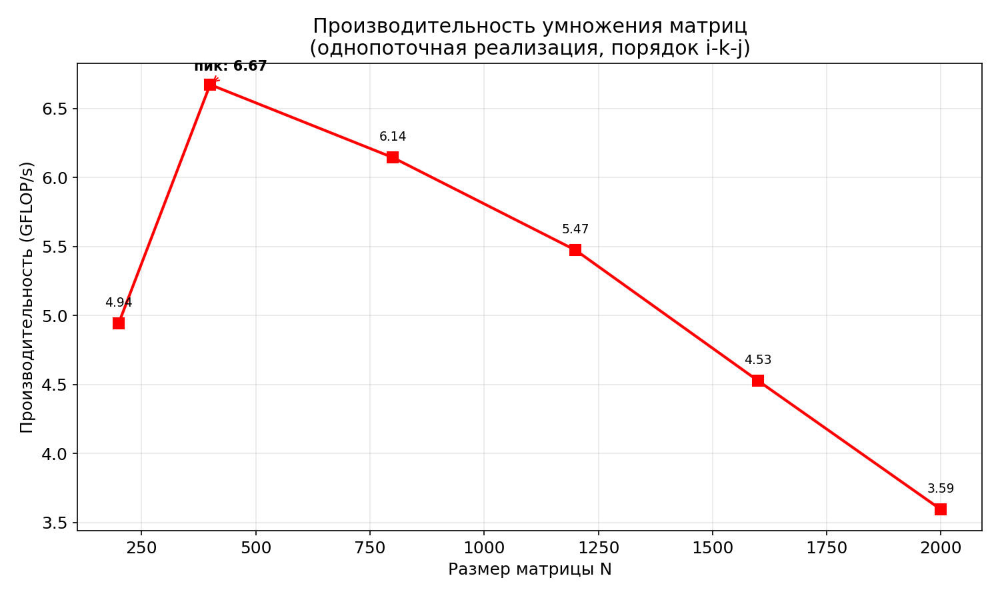
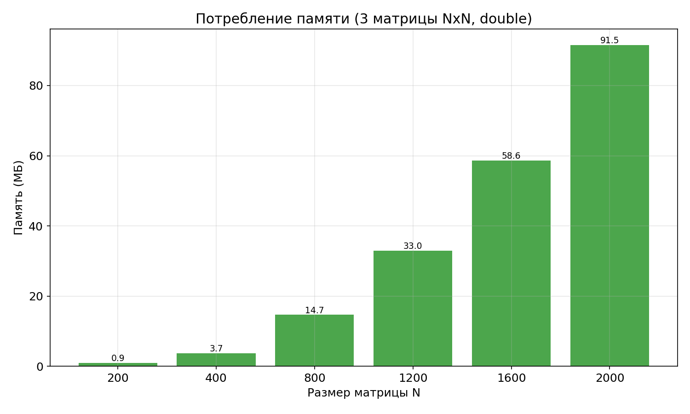
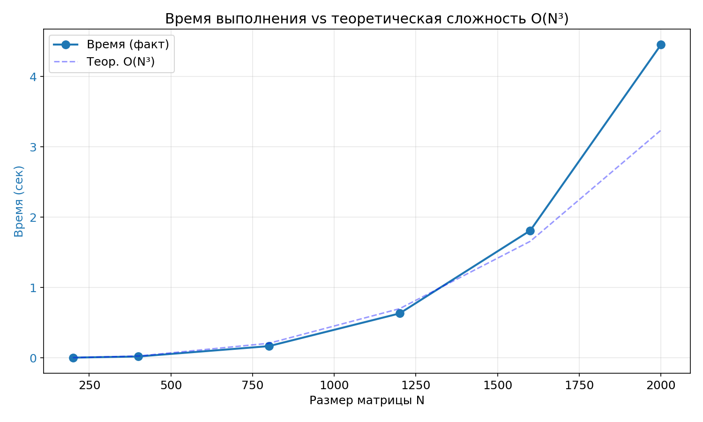

# Лабораторная работа №1. Последовательное умножение квадратных матриц

## 1. Постановка задачи

Разработать программу на языке C++ для перемножения двух квадратных матриц.
Реализация должна быть **однопоточной**, выполнена **вручную циклами** (без использования
библиотечных функций умножения), с порядком обхода **i-k-j**.

**Требования:**
- Исходные данные — файлы с матрицами
- Выходные данные — файл с результирующей матрицей, время выполнения, объём задачи, затраты памяти
- Автоматизированная верификация результатов (Python + NumPy)
- Эксперименты для размеров: 200, 400, 800, 1200, 1600, 2000

## 2. Описание алгоритма

### 2.1 Порядок обхода i-k-j

Стандартный алгоритм умножения матриц C = A × B:

```
C[i][j] = Σ(k=0..N-1) A[i][k] * B[k][j]
```

В реализации используется порядок циклов **i-k-j**:

```cpp
for (int i = 0; i < n; i++) {
    for (int k = 0; k < n; k++) {
        double a_ik = A[i * n + k]; // загружаем один раз
        for (int j = 0; j < n; j++) {
            C[i * n + j] += a_ik * B[k * n + j];
        }
    }
}
```

**Особенности i-k-j:**
- Внутренний цикл по `j` обращается к `B[k][j]` и `C[i][j]` последовательно по строке (stride=1)
- Значение `A[i][k]` вынесено во временную переменную — исключается повторное обращение к памяти
- Этот порядок более дружественный к кэшу, чем стандартный i-j-k, **но при больших N матрицы перестают помещаться в кэш**, что снижает производительность

### 2.2 Хранение матриц

Матрицы хранятся в одномерных массивах (`new double[n*n]`) с линейной индексацией `[i*n+j]`.

### 2.3 Вычислительная сложность

- Количество операций: **2N³** (N³ умножений + N³ сложений)
- Сложность по памяти: **3N²** элементов типа `double` (24N² байт)

## 3. Структура проекта

```
project/
├── matrix_mult.cpp        — Основная программа (C++)
├── generate_matrices.py   — Генерация случайных матриц
├── verify.py              — Верификация через NumPy
├── plot_results.py        — Построение графиков
├── run.bat                — Запуск для одного размера
├── run_experiments.bat    — Серия экспериментов (200..2000)
├── data/                  — Графики результатов
│   ├── graph_time.png
│   ├── graph_gflops.png
│   ├── graph_memory.png
│   └── graph_combined.png
└── README.md              — Данный отчёт
```

## 4. Верификация

Результат умножения проверяется скриптом `verify.py`:
1. Загружает матрицы A, B и результат C++ из файлов
2. Вычисляет эталонное произведение `C_ref = A @ B` через NumPy (BLAS)
3. Сравнивает по относительной ошибке нормы Фробениуса

Критерий: относительная ошибка < 10⁻⁶.

**Все эксперименты прошли верификацию успешно. ✅**

## 5. Результаты экспериментов

### 5.1 Конфигурация

- **Процессор:** *[указать модель]*
- **ОС:** Windows 10/11
- **Компилятор:** g++ (MinGW-w64), флаг `-O2`
- **Тип данных:** `double` (64 бит)
- **Режим:** однопоточный

### 5.2 Таблица результатов

| N    | Время (сек) | Объём (GFLOP) | Произв. (GFLOP/s) | Память (МБ) |
|------|-------------|---------------|--------------------|-------------|
| 200  | 0.003       | 0.016         | 4.63               | 0.92        |
| 400  | 0.023       | 0.128         | 5.63               | 3.66        |
| 800  | 0.165       | 1.024         | 6.20               | 14.65       |
| 1200 | 0.607       | 3.456         | 5.69               | 32.96       |
| 1600 | 1.862       | 8.192         | 4.40               | 58.59       |
| 2000 | 4.474       | 16.000        | 3.58               | 91.55       |

### 5.3 Графики

#### Зависимость времени от размера матрицы



#### Производительность (GFLOP/s)



#### Потребление памяти



#### Сравнение с теоретической сложностью O(N³)



## 6. Анализ результатов

### 6.1 Временная сложность

Экспериментальные данные подтверждают теоретическую сложность **O(N³)**:
- При увеличении N от 200 до 2000 (в 10 раз) время выросло от 0.003 до 4.474 сек (~1500 раз ≈ 10³)
- Кривая фактического времени хорошо ложится на теоретическую кривую N³

### 6.2 Производительность и влияние кэша

Производительность в GFLOP/s **не является стабильной** — она демонстрирует характерный
профиль с пиком и последующим падением:

| Диапазон N  | GFLOP/s      | Причина                                     |
|-------------|-------------|----------------------------------------------|
| 200 → 800   | 4.63 → **6.20** ↑ | Рост: амортизация накладных расходов, данные помещаются в кэш L2/L3 |
| 800 → 2000  | **6.20** → 3.58 ↓ | Падение: матрицы перестают помещаться в кэш    |

**Объяснение пика при N=800:**

При N=800 одна матрица занимает 800 × 800 × 8 = **4.88 МБ**. Три матрицы — **~14.6 МБ**.
Это соизмеримо с типичным размером кэша L3 (6–16 МБ), и значительная часть данных
ещё помещается в кэш, обеспечивая высокую скорость доступа.

При N=1600 одна матрица — **19.5 МБ**, три матрицы — **~58.6 МБ** — это многократно
превышает размер L3 кэша, что приводит к частым промахам кэша (cache misses) и
обращениям к оперативной памяти, которая в десятки раз медленнее.

### 6.3 Память

Потребление памяти растёт как **O(N²)** и определяется формулой:

```
Память = 3 × N² × 8 байт
```

- N=200: ~0.9 МБ — легко помещается в кэш
- N=2000: ~91.6 МБ — значительно превышает размер кэша, но укладывается в оперативную память

## 7. Выводы

1. **Реализован** алгоритм умножения квадратных матриц с порядком обхода i-k-j.
   Реализация — однопоточная, без использования библиотечных функций умножения.

2. **Подтверждена корректность** — все результаты прошли автоматическую верификацию
   через NumPy с относительной ошибкой менее 10⁻⁶.

3. **Экспериментально подтверждена** теоретическая сложность O(N³).

4. **Обнаружена выраженная зависимость производительности от размера кэша:**
   - Пик производительности (**6.20 GFLOP/s**) достигается при N=800, когда
     рабочий набор данных (~14.6 МБ) ещё частично помещается в кэш L3.
   - При N=2000 производительность падает до **3.58 GFLOP/s** (снижение на 42%)
     из-за того, что рабочий набор (~91.6 МБ) многократно превышает кэш.

5. **Производительность однопоточной реализации** (3.6–6.2 GFLOP/s) существенно ниже
   пиковой производительности современных процессоров, что создаёт потенциал для
   ускорения через распараллеливание в последующих лабораторных работах.

## 8. Инструкция по запуску

### Полная серия экспериментов с графиками:
```
run_experiments.bat
```

### Один размер:
```
run.bat
```

### Требования:
- g++ (MinGW-w64)
- Python 3 + `numpy` + `matplotlib`