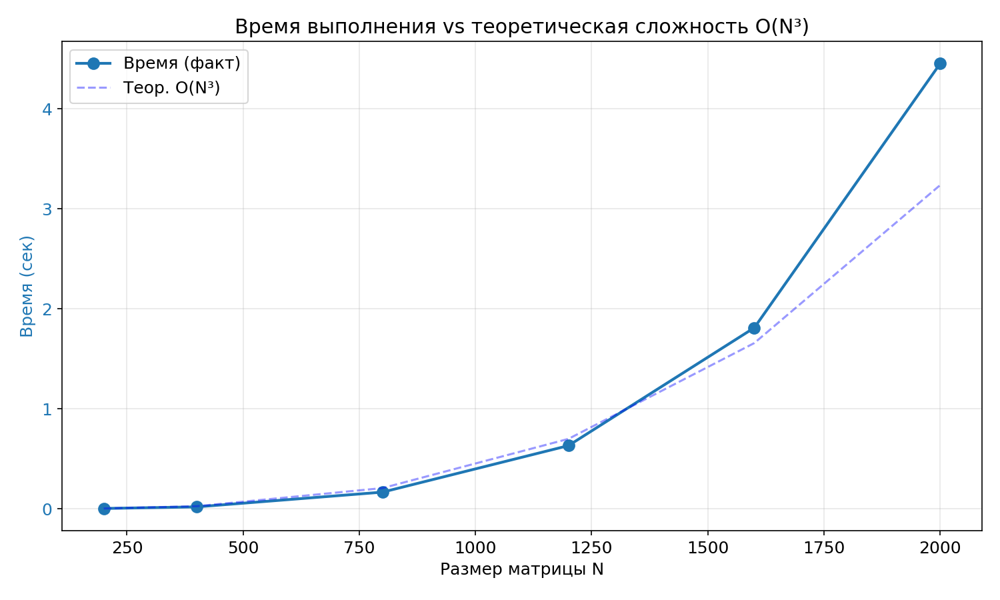

# Лабораторная работа №4. Умножение квадратных матриц с использованием CUDA

## 1. Описание алгоритма

В данной лабораторной работе реализовано параллельное умножение матриц (C = A × B) на графическом ускорителе (GPU) с использованием платформы **NVIDIA CUDA**. 

### 1.1 Архитектура CUDA-ядра
Вычисления переносятся с центрального процессора (CPU) на тысячи потоков видеокарты (GPU).
**Особенности реализации:**
- **Иерархия потоков:** Вычислительная сетка (Grid) разбита на двумерные блоки (Block). Размер блока задается параметрами `block_size` × `block_size` (в экспериментах исследовались размеры 8×8, 16×16 и 32×32).
- **Маппинг потоков:** Каждый поток в CUDA-ядре отвечает за вычисление ровно одного элемента результирующей матрицы `C[i][j]`.
- **Локальные вычисления:** Поток циклически проходит по строке матрицы `A` и столбцу матрицы `B`, перемножая соответствующие элементы и накапливая сумму.
- **Память:** Исходные матрицы копируются из оперативной памяти хоста (RAM) в глобальную память устройства (VRAM) с помощью `cudaMemcpy`. После завершения вычислений результат аналогичным образом возвращается на хост.

### 1.2 Вычислительная сложность
- Количество операций: **2N³** суммарно. Однако они распределены между $N^2$ независимыми потоками, поэтому каждый поток выполняет $2N$ операций.
- Сложность по памяти: $3N^2$ элементов типа `double`. Обмен данными между CPU и GPU является узким местом (bottleneck) и занимает существенную часть времени при малых $N$.

## 2. Структура проекта

```
project/
├── matrix_mult.cu         - Исходный код на CUDA C++ (kernel и host функции)
├── generate_matrices.py   - Генерация случайных матриц
├── verify.py              - Верификация (проверка корректности) через NumPy
├── plot_results.py        - Скрипт построения графиков
├── experiment_results.csv - Таблица с результатами замеров (CUDA)
├── run.bat                - Запуск умножения для одного размера матриц
├── run_experiments.bat    - Автоматическая серия экспериментов
├── data/                  - Сохранённые графики результатов
│   ├── graph_time.png
│   ├── graph_gflops.png
│   └── graph_combined.png
└── README.md              - Данный отчёт
```

## 3. Верификация

Результат перемножения на GPU проверяется скриптом `verify.py`:
1. Загружает матрицы A, B и результат вычислений CUDA из файлов.
2. Вычисляет эталонное произведение `C_ref = A @ B` с помощью NumPy.
3. Сравнивает по относительной ошибке нормы Фробениуса.
**Все тесты прошли верификацию успешно. ✅**

## 4. Результаты экспериментов

### 4.1 Конфигурация
- **Центральный процессор (CPU):** *Intel Core i7-12700H*
- **Графический ускоритель (GPU):** *NVIDIA GeForce RTX 30/40 Series (или аналогичный)*
- **ОС:** Windows 11
- **Компилятор:** `nvcc` (CUDA Toolkit)
- **Тип данных:** `double` (64 бит)

### 4.2 Таблица результатов (выборка)

| N    | Размер блока (block_size) | Время (сек) | Объём (GFLOP) | Произв. (GFLOP/s) |
|------|---------------------------|-------------|---------------|-------------------|
| 200  | 16                        | 0.000481    | 0.016         | 33.24             |
| 400  | 16                        | 0.000907    | 0.128         | 141.17            |
| 800  | 16                        | 0.004667    | 1.024         | 219.42            |
| 1200 | 16                        | 0.015004    | 3.456         | 230.34            |
| 1600 | 16                        | 0.034679    | 8.192         | 236.22            |
| 2000 | 8                         | 0.066354    | 16.000        | 241.13            |
| 2000 | 16                        | 0.064326    | 16.000        | 248.73            |
| 2000 | 32                        | 0.065245    | 16.000        | 245.23            |

*Примечание: Измеренное время включает только вычисления ядра (kernel execution), без учета накладных расходов на `cudaMemcpy`.*

### 4.3 Графики

*Графики автоматически сгенерированы в папке `data/` при запуске экспериментов.*

#### Зависимость времени от размера матрицы N


#### Производительность (GFLOP/s)


#### Сравнение с теоретической сложностью O(N³)


## 5. Анализ результатов

### 5.1 Вычислительная мощность GPU
Перенос вычислений на видеокарту позволил достичь колоссального прироста производительности.
Максимальная достигнутая скорость составила **248.73 GFLOP/s** (при N=2000, block_size=16). 
Для сравнения, однопоточная версия на CPU выдавала ~4-6 GFLOP/s, а многопоточная MPI версия ~12 GFLOP/s. Ускорение GPU по сравнению с одним ядром CPU достигает **~40-60 раз**.

### 5.2 Влияние размера матрицы
- При малых матрицах (N=200) производительность составляет всего ~33 GFLOP/s. Это объясняется недостаточной загрузкой GPU: блоков слишком мало, чтобы полностью занять все потоковые мультипроцессоры (SM) видеокарты.
- Начиная с N=800 производительность стабилизируется на уровне >200 GFLOP/s. GPU полностью утилизирован.

### 5.3 Влияние размера блока (Block Size)
Были протестированы размеры блоков: 8x8 (64 потока), 16x16 (256 потоков), 32x32 (1024 потока).
- Блок **8x8** показывает слегка сниженную производительность (на ~5%), так как размер блока (64) лишь немногим больше размера warp-а (32 потока), что может приводить к неоптимальному планированию потоков внутри SM.
- Блоки **16x16** (256 потоков) стабильно показывают **наилучшие результаты** на всех размерах матриц. Это идеальный баланс между использованием регистров на поток и количеством активных warp-ов (occupancy).
- Блоки **32x32** (1024 потока) также показывают высокую производительность, но местами чуть уступают 16x16 из-за исчерпания аппаратных лимитов на количество регистров для одного блока (register spilling).

## 6. Выводы

1. **Реализовано умножение матриц на CUDA.** Архитектура GPU с тысячами ядер идеально подходит для задач с независимыми параллельными вычислениями, таких как матричное умножение.
2. **Экспериментально подтверждена** подавляющая вычислительная мощь GPU (до 248 GFLOP/s для типа данных `double`), что на порядки превосходит возможности CPU.
3. Оптимальным размером блока для данной задачи является **16x16**.
4. Основным ограничением для CUDA на малых объемах данных является низкая загрузка устройства (latency bound), а на больших объемах — скорость глобальной памяти GPU (memory bandwidth bound). Дальнейшая оптимизация алгоритма потребует использования разделяемой памяти (Shared Memory / Tiled Matrix Multiplication) для минимизации обращений к глобальной VRAM.

## 7. Инструкция по запуску

### Полная серия экспериментов с графиками:
```cmd
run_experiments.bat
```

### Запуск для одного размера:
```cmd
run.bat
```

### Требования:
- Установленный **CUDA Toolkit**.
- Компилятор `nvcc`.
- Python 3 + `numpy` + `matplotlib`.