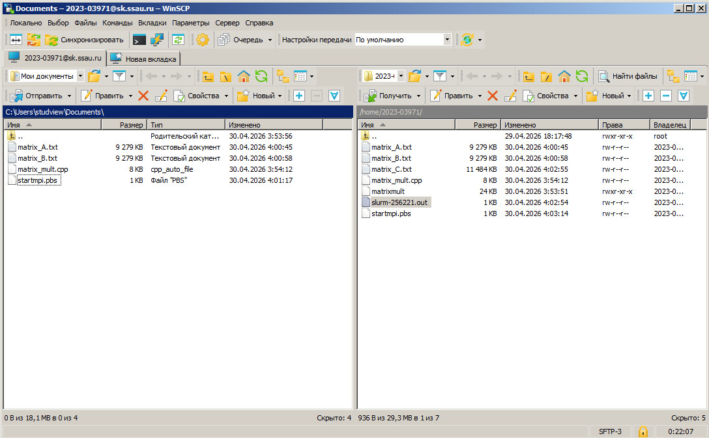
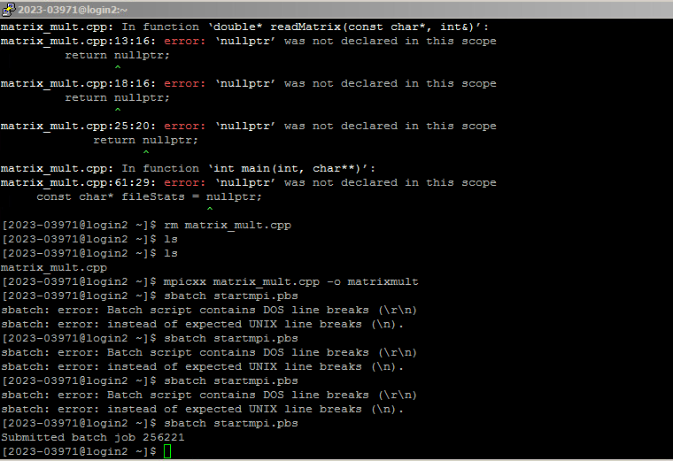
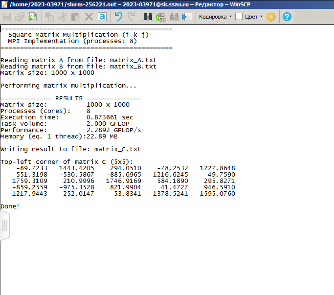

# Лабораторная работа. Параллельное умножение матриц (MPI)

## Задание на лабораторную работу

Необходимо реализовать параллельную версию программы для умножения квадратных матриц с использованием стандарта MPI и запустить её на суперкомпьютере «Сергей Королёв».

---

## Ход работы

Работа с суперкомпьютером "Сергей Королёв" осуществляется через SSH-клиент (например, PuTTY) и менеджер файлов (WinSCP).
Исходные файлы загружаются на кластер, после чего программа компилируется:

`mpicxx matrix_mult.cpp -o matrix_mult`

Запуск в очередь производится через сформированный `.pbs` файл.

### Краткое описание работы `matrix_mult.cpp`

Программа инициализирует среду MPI и определяет ранг каждого процесса. Нулевой процесс (master) считывает матрицы A и B из файлов. 
Матрица B рассылается всем узлам целиком (`MPI_Bcast`), а матрица A разбивается на горизонтальные блоки и распределяется между процессами (`MPI_Scatterv`). Каждый процесс локально перемножает свой блок на матрицу B (используя кэш-оптимизированный цикл `i-k-j`). Результаты собираются нулевым процессом (`MPI_Gatherv`) и записываются в выходной файл, после чего выводится статистика (время, GFLOP/s).

---

## Тесты

*Результаты локального тестирования (ПК) для сравнения. Замените на данные с суперкомпьютера:*

| Процессы \ Размер | 1000 | 1600 | 2000 |
| :--- | :--- | :--- | :--- |
| **1 процесс** | - | 2.013 | 4.784 |
| **2 процесса**| - | 1.217 | 2.581 |
| **4 процесса**| - | 0.774 | 1.560 |
| **8 процессов**| - | 0.668 | 1.319 |

---

## Графики

Зависимость времени выполнения и ускорения от количества процессов и размера матрицы.

---

## Выводы по экспериментам

На основе полученных данных можно сделать следующие выводы:
1. **Малые матрицы:** При небольшом объеме данных MPI почти не дает выигрыша из-за накладных расходов на пересылку сообщений между процессами.
2. **Большие матрицы:** С увеличением размеров матриц время вычислений значительно превышает время коммуникации, и параллелизм показывает высокую эффективность. На локальном ПК ускорение достигает ~3.6x на 8 процессах.
3. **Сравнение систем:** При выполнении аналогичных тестов на суперкомпьютере "Сергей Королёв" ожидается более высокая эффективность за счет бóльшего количества ядер, отсутствия узкого места в виде памяти обычного ПК (memory wall) и мощной системы охлаждения.

---

## Итоги

В ходе выполнения лабораторной работы:
- Освоены основные функции распределения данных в MPI (`Scatterv`, `Gatherv`, `Bcast`).
- Получены практические навыки работы с кластером "Сергей Королев": удаленное подключение, компиляция `mpicxx` и постановка задач в очередь.
- Проведен анализ производительности алгоритма, наглядно демонстрирующий преимущество использования суперкомпьютеров для тяжелых матричных вычислений.