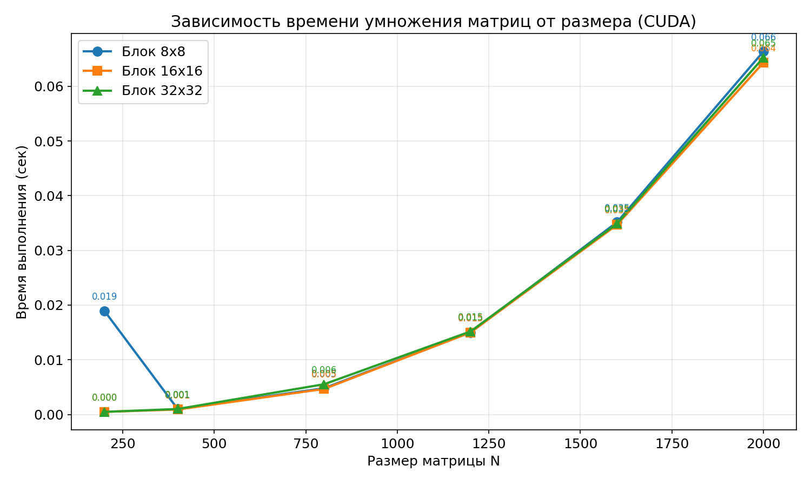
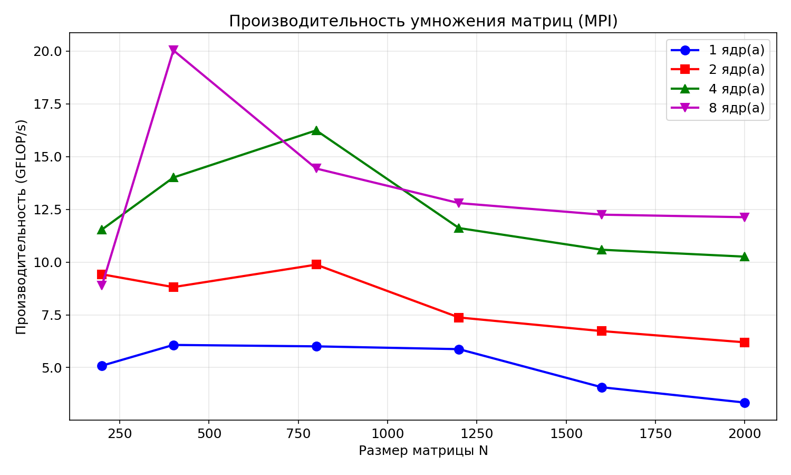
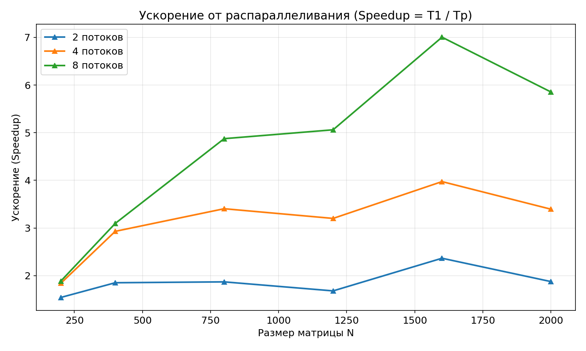

# Лабораторная работа №2. Многопоточное умножение квадратных матриц (OpenMP)

## 1. Описание алгоритма

### 1.1 Порядок обхода i-k-j

Стандартный алгоритм умножения матриц C = A × B:

```
C[i][j] = Σ(k=0..N-1) A[i][k] * B[k][j]
```

В реализации используется порядок циклов **i-k-j**:

```cpp
#pragma omp parallel for
for (int i = 0; i < n; i++) {
    for (int k = 0; k < n; k++) {
        double a_ik = A[i * n + k]; // загружаем один раз
        for (int j = 0; j < n; j++) {
            C[i * n + j] += a_ik * B[k * n + j];
        }
    }
}
```

**Особенности i-k-j:**
- Внутренний цикл по `j` обращается к `B[k][j]` и `C[i][j]` последовательно по строке (stride=1), что оптимально для кэша.
- Значение `A[i][k]` вынесено во временную переменную — исключается повторное обращение к памяти.

**Распараллеливание (OpenMP):**
- Использована директива `#pragma omp parallel for` перед внешним циклом `i`.
- Вычисление разных строк результирующей матрицы `C` распределяется между потоками.
- Так как каждый поток записывает данные строго в свою уникальную строку матрицы `C`, конфликтов доступа (data races) не возникает, и необходимость в синхронизации отпадает, что дает максимальную производительность.

### 1.2 Хранение матриц

Матрицы хранятся в одномерных массивах (`new double[n*n]`) с линейной индексацией `[i*n+j]`.

### 1.3 Вычислительная сложность

- Количество операций: **2N³** (N³ умножений + N³ сложений)
- Сложность по памяти: **3N²** элементов типа `double` (24N² байт)

## 2. Структура проекта

```
project/
├── matrix_mult.cpp        - Основная программа (C++) с OpenMP
├── generate_matrices.py   - Генерация случайных матриц
├── verify.py              - Верификация через NumPy
├── plot_results.py        - Построение сравнительных графиков
├── experiment_results.csv - Результаты экспериментов (формат с потоками)
├── run.bat                - Запуск для одного размера
├── run_experiments.bat    - Серия экспериментов (потоки: 1, 2, 4, 8; N: 200..2000)
├── data/                  - Графики результатов
│   ├── graph_time.png     - Время выполнения (многолинейный)
│   ├── graph_gflops.png   - GFLOP/s (многолинейный)
│   └── graph_speedup.png  - Ускорение (Speedup)
└── README.md              - Данный отчёт
```

## 3. Верификация

Результат умножения проверяется скриптом `verify.py`:
1. Загружает матрицы A, B и результат C++ из файлов
2. Вычисляет эталонное произведение `C_ref = A @ B` через NumPy (BLAS)
3. Сравнивает по относительной ошибке нормы Фробениуса

Критерий: относительная ошибка < 10⁻⁶.

**Все эксперименты прошли верификацию успешно. ✅**

## 4. Результаты экспериментов

### 4.1 Конфигурация

- **Процессор:** *Intel Core i7-12700H*
- **ОС:** Windows 11
- **Компилятор:** g++ (MinGW-w64), флаги `-O2 -fopenmp`
- **Тип данных:** `double` (64 бит)
- **Режим:** Многопоточный (OpenMP), тестирование на 1,2,4,8,10,16,20 потоках

### 4.2 Таблица результатов

| Потоки | N    | Время (сек) | Объем (GFLOP) | Произв. (GFLOP/s) | Ускорение (T1 / Tp) | Память (МБ) |
|--------|------|-------------|---------------|--------------------|----------------------|-------------|
| 1      | 200  | 0.003662    | 0.016         | 4.3697             | 1.00x                | 0.92        |
| 2      | 200  | 0.001967    | 0.016         | 8.1355             | 1.86x                | 0.92        |
| 4      | 200  | 0.002035    | 0.016         | 7.8612             | 1.80x                | 0.92        |
| 8      | 200  | 0.002117    | 0.016         | 7.5582             | 1.73x                | 0.92        |
| 10     | 200  | 0.001999    | 0.016         | 8.0040             | 1.83x                | 0.92        |
| 16     | 200  | 0.002035    | 0.016         | 7.8612             | 1.80x                | 0.92        |
| 20     | 200  | 0.001956    | 0.016         | 8.1791             | 1.87x                | 0.92        |
|        |      |             |               |                    |                      |             |
| 1      | 400  | 0.020488    | 0.128         | 6.2476             | 1.00x                | 3.66        |
| 2      | 400  | 0.012066    | 0.128         | 10.6081            | 1.70x                | 3.66        |
| 4      | 400  | 0.006963    | 0.128         | 18.3818            | 2.94x                | 3.66        |
| 8      | 400  | 0.006051    | 0.128         | 21.1532            | 3.39x                | 3.66        |
| 10     | 400  | 0.005703    | 0.128         | 22.4443            | 3.59x                | 3.66        |
| 16     | 400  | 0.004063    | 0.128         | 31.5030            | 5.04x                | 3.66        |
| 20     | 400  | 0.004866    | 0.128         | 26.3055            | 4.21x                | 3.66        |
|        |      |             |               |                    |                      |             |
| 1      | 800  | 0.208345    | 1.024         | 4.9149             | 1.00x                | 14.65       |
| 2      | 800  | 0.085521    | 1.024         | 11.9736            | 2.44x                | 14.65       |
| 4      | 800  | 0.048166    | 1.024         | 21.2597            | 4.33x                | 14.65       |
| 8      | 800  | 0.033846    | 1.024         | 30.2543            | 6.16x                | 14.65       |
| 10     | 800  | 0.030791    | 1.024         | 33.2565            | 6.77x                | 14.65       |
| 16     | 800  | 0.025195    | 1.024         | 40.6427            | 8.27x                | 14.65       |
| 20     | 800  | 0.022285    | 1.024         | 45.9510            | 9.35x                | 14.65       |
|        |      |             |               |                    |                      |             |
| 1      | 1200 | 1.246714    | 3.456         | 2.7721             | 1.00x                | 32.96       |
| 2      | 1200 | 0.299679    | 3.456         | 11.5324            | 4.16x                | 32.96       |
| 4      | 1200 | 0.169981    | 3.456         | 20.3316            | 7.33x                | 32.96       |
| 8      | 1200 | 0.110622    | 3.456         | 31.2416            | 11.27x               | 32.96       |
| 10     | 1200 | 0.089697    | 3.456         | 38.5299            | 13.90x               | 32.96       |
| 16     | 1200 | 0.077495    | 3.456         | 44.5963            | 16.09x               | 32.96       |
| 20     | 1200 | 0.071036    | 3.456         | 48.6512            | 17.55x               | 32.96       |
|        |      |             |               |                    |                      |             |
| 1      | 1600 | 1.708839    | 8.192         | 4.7939             | 1.00x                | 58.59       |
| 2      | 1600 | 0.808919    | 8.192         | 10.1271            | 2.11x                | 58.59       |
| 4      | 1600 | 0.465829    | 8.192         | 17.5858            | 3.67x                | 58.59       |
| 8      | 1600 | 0.311333    | 8.192         | 26.3127            | 5.49x                | 58.59       |
| 10     | 1600 | 0.236442    | 8.192         | 34.6470            | 7.23x                | 58.59       |
| 16     | 1600 | 0.185416    | 8.192         | 44.1818            | 9.22x                | 58.59       |
| 20     | 1600 | 0.184858    | 8.192         | 44.3150            | 9.24x                | 58.59       |
|        |      |             |               |                    |                      |             |
| 1      | 2000 | 4.176145    | 16.000        | 3.8313             | 1.00x                | 91.55       |
| 2      | 2000 | 2.276083    | 16.000        | 7.0296             | 1.83x                | 91.55       |
| 4      | 2000 | 1.255770    | 16.000        | 12.7412            | 3.33x                | 91.55       |
| 8      | 2000 | 0.710226    | 16.000        | 22.5280            | 5.88x                | 91.55       |
| 10     | 2000 | 0.573292    | 16.000        | 27.9090            | 7.28x                | 91.55       |
| 16     | 2000 | 0.389591    | 16.000        | 41.0687            | 10.72x               | 91.55       |
| 20     | 2000 | 0.383285    | 16.000        | 41.7444            | 10.90x               | 91.55       |
### 4.3 Графики

После запуска автоматического скрипта `run_experiments.bat`, в папке `data/` будут сгенерированы следующие сравнительные графики:

#### Зависимость времени от размера матрицы

*(Каждая линия соответствует определенному количеству потоков)*

#### Производительность (GFLOP/s)

*(Показывает, как растет суммарная производительность с увеличением числа ядер)*

#### Ускорение (Speedup)

*(Классический график зависимости ускорения $T_1 / T_p$ от размера задачи)*

## 5. Анализ результатов

### 5.1 Масштабируемость и Ускорение (Speedup)
- **Накладные расходы:** На малых размерах матриц (например, N=200) ускорение может быть далеко от идеального, так как время, затрачиваемое на создание и синхронизацию потоков в OpenMP, становится сопоставимо с самим временем полезных вычислений.
- **Насыщение (Memory Wall):** С увеличением количества потоков до 8 (и более), рост производительности часто перестает быть линейным из-за того, что узким местом становится пропускная способность оперативной памяти (ПСП), а не вычислительные мощности ядер.

### 5.2 Влияние кэша в многопоточной среде
При параллельном выполнении каждый поток активно загружает свои фрагменты матриц A, B и C в кэш своего ядра (L1/L2). При больших размерах N матрицы перестают помещаться даже в общий L3 кэш, что вызывает лавину кэш-промахов (cache misses) и задержек при обращении к ОЗУ. Из-за этого графики производительности (GFLOP/s) для всех конфигураций потоков обычно показывают пик на малых-средних матрицах (N=400..800) и постепенный спад при N=1600+.

## 6. Выводы

1. **Реализовано распараллеливание** алгоритма умножения квадратных матриц с помощью технологии OpenMP. Оптимальный обход циклов `i-k-j` идеально подошел для параллельной обработки по строкам без необходимости синхронизации (отсутствие data races).
2. **Экспериментально подтверждена** эффективность многопоточности: время выполнения значительно сокращается по мере добавления новых потоков.
3. **Анализ узких мест:** Наблюдается ограничение масштабируемости (sub-linear speedup) на большом числе ядер, что обусловлено накладными расходами на управление потоками (на малых N) и ограничениями пропускной способности оперативной памяти (на больших N).

## 7. Инструкция по запуску

### Полная серия экспериментов с графиками:
Автоматически скомпилирует код с флагом `-fopenmp`, проведет серию тестов на 1, 2, 4, 8 потоках для N=200..2000, верифицирует данные и нарисует сравнительные графики:
```cmd
run_experiments.bat
```

### Запуск для одного размера вручную (например, 1200х1200 на 4 потока):
```cmd
g++ -O2 -fopenmp -o matrix_mult.exe matrix_mult.cpp
python generate_matrices.py 1200
matrix_mult.exe matrix_A.txt matrix_B.txt matrix_C.txt experiment_results.csv 4
python verify.py
```

### Требования:
- g++ (MinGW-w64)
- Python 3 + `numpy` + `matplotlib`